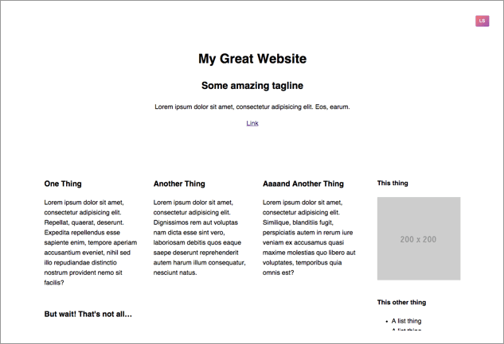

#Layout Scout

__Layout Scout is a visual aid for building responsive layouts.__

Layout Scout will sniff out the content blocks in your markup and inject random background colours to those blocks. They serve as good visual feedback during development for styling your layouts and setting your media queries. Simply toggle the button on and off to apply/remove the colours.

As a front-end developer, chances are you create your markup and then hunt through your stylesheet (or dev tools) to apply temporary background colours to your content selectors.

Temporary background colours serve as good visual feedback for styling your layouts and setting your media queries, but they waste time and require clean-up work when you're done. Also, they're ugly.

<!-- [layouscout]: /img/ls.gif "Layout Scout" -->

[See the demo](http://lucaslemonnier.com/layoutscout "Layout Scout")

